I took part in a six-month-long course in cybersecurity essentials, hosted by Future Female and HelSec. The CTF was a final challenge including OSINT, memory forensics etc. Some information has been redacted from the pictures to protect privacy.

As of October 12th 2020 this post is still being updated.

## Cybersecurity essentials CTF: WEB

### WEB 1

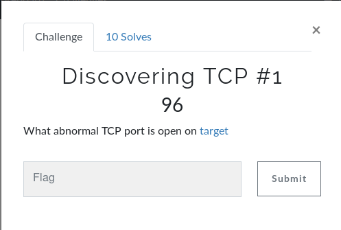
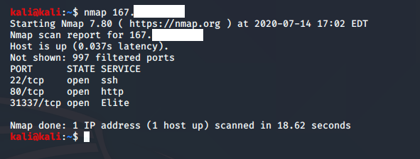

This challenge was quite straightforward. I pinged target.(redacted) to get the IP address and then did a simple Nmap scan of it to acquire the open ports – 22, 80 and 31337. Out of these three the 31337/tcp was the one that stuck out. Knowing the lighthearted nature of this challenge, that was indeed the correct answer, giving me the great start as a 31337 h4Xx0r.

### WEB 2

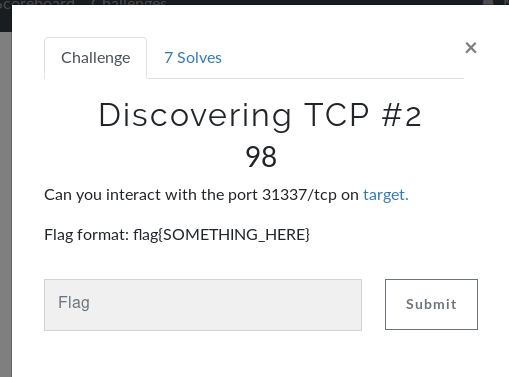

The next challenge was to try and interact with the port 31337/tcp. Giving it a good old call with netcat, the response was to “PLS ANSWER SOMETHING”. After trying to be funny and imaginative with my responses, I resorted to taking it literally – so I answered “SOMETHING”

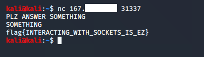

thus getting the flag flag{INTERACTING_WITH_SOCKETS_IS_EZ}. My 31337 H4xX0r status is confirmed. 

### WEB 3

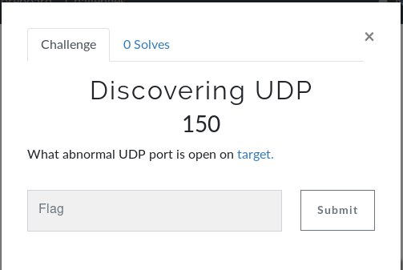

The next challenge was to find a UDP port on target.(redacted). After different unfruitful attempts with Nmap and other tools it turned out that there was a problem in the challenge itself, so it was not solveable. 

### WEB 4

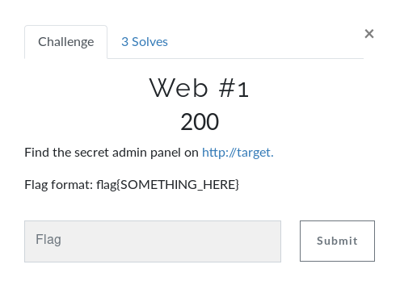

For this challengeI used Dirb fuzzing tool and with the assistance of wordlist jboss.txt I found the following:

START_TIME: Tue Jun 23 03:18:53 2020
URL_BASE: http://target.(redacted)/
WORDLIST_FILES: /usr/share/wordlists/dirb/vulns/jboss.txt

-----------------

GENERATED WORDS: 19

---- Scanning URL: http://target.(redacted) ----
==> DIRECTORY: http://target.(redacted)/web-console/
+ http://target.(redacted)/web-console/ (CODE:403|SIZE:555)
+ http://target.(redacted)/web-console/Invoker (CODE:200|SIZE:25)

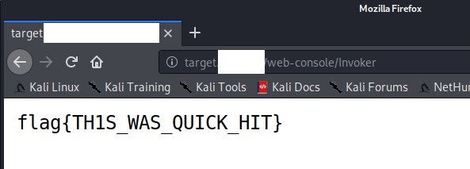

Navigating my way into http://target.(redacted)/web-console/Invoker I was able to acquire the flag: flag{TH1S_WAS_QUICK_HIT}

The other directory that I could find was http://target.(redacted)/Personals but I could not interact with it.

### WEB 5

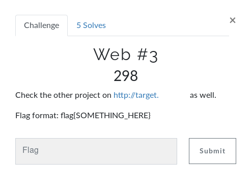

The target website looked like this

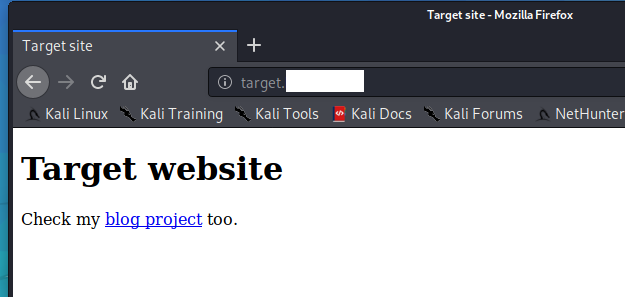

But clicking the link does not take you to a live site. When trying to resolve the host, it tells you it is localhost. So that seems odd. I tried looking at what happens in the request itself with Wireshark, and after Googling a bit I found information about virtualhosts and decided to modify the host header in my curl request.

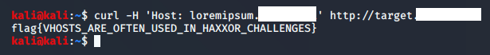

This was a very enlightening challenge for me because it was simple in the end, but this information was pretty new to me. Flag was flag{VHOSTS_ARE_OFTEN_USED_IN_HAXXOR_CHALLENGES}

## SOC

### SOC 1

"What is the centralized log system called (abbreviation)?"

SIEM = Security Information and Event Management

### SOC 2

"Which HTTP command lists all available methods (GET, POST etc.)?"

You can find good info here: https://developer.mozilla.org/en-US/docs/Web/HTTP/Methods

Flag: OPTIONS

### SOC 3

"There’s Linux/Tsunami DOS related traffic in the access.log. What is the corresponding IP address of potentially infected host?"

I was not familiar with analysing server logs so I went ahead and watched a video on Apache Web Server Access Log analysis by steve Gordon: https://www.youtube.com/watch?v=IsrjRtic5v8 and started just going through the access log file manually.

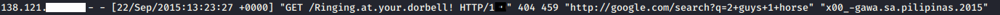

This request looked really out of place, so I looked into it a bit further and found that there are two separate instances of it included - the first one is standalone and is met with a 404. The second one however gives us a an HTTP 200 successful request. I turned to Google and found this article written by Kurtis Rader outlining this as a shellshock attack: https://www.skepticism.us/posts/2015/05/new-in-your-face-malware-attacks-me-ringing-at-your-dorbell/

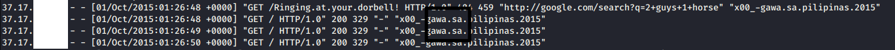

Essentially the attack takes advantage of a vulnerability where web-facing Unix systems accept Bash commands. This attack turns the vulnerable systems into bots enabling them to be used in further vulnerability scanners of online systems and being a part of botnet distributed denial of service attacks. The CVE-ID is CVE-2014-6271. More detailed description can be found at https://cve.mitre.org/cgi-bin/cvename.cgi?name=CVE-2014-6271

Flag was 37.17.130.36

### SOC 4 & 5

SOC 4: Which host has most entries in the access.log? Answer the IP address

I did something that was maybe a bit crude and opened the access log file in a text editor that could tell how many hits a find command would find. I went through the file and gathered the IP's that I could see popping up repeatedly, did a search on them and logged them in my text editor. Eventually I found the answer which was 61.160.247.11. found a total of 73 times, which was the answer to SOC #5:

SOC 5: IP address 61.160.247.11 has the most entries in the access.log. How many?

73 entries.

## Memory forensics

The main tool that was used in this section was Volatility. As of October 12th 2020 this part of the writeup is still being updated. 

### Memory forensics 1
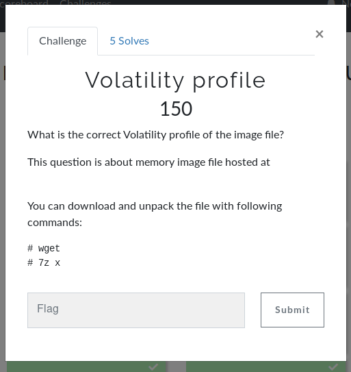

When you get a memory image file the first things you need to do is to determine what operating system the image file is of. The easiest way to do this with Volatility is with kdbgscan or imageinfo.

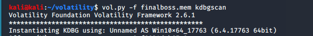

Correct profile was Win10x64_17763

### Memory forensics 2

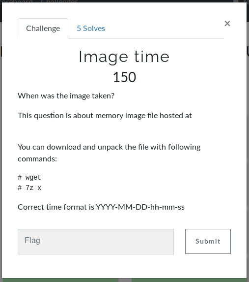

Here I used imageinfo within Volatility to get more information:

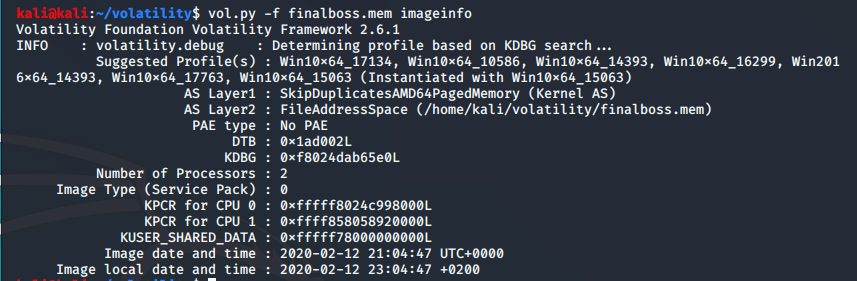

Flag: 2020-02-12-21-04-47

### Memory forensics 3

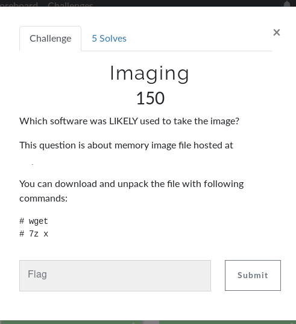

Running pstree with Volatility specifyig the correct image profile I found the running processes when the image was taken:

kali@kali:~/volatility$ vol.py -f finalboss.mem --profile=Win10x64_17763 pstree

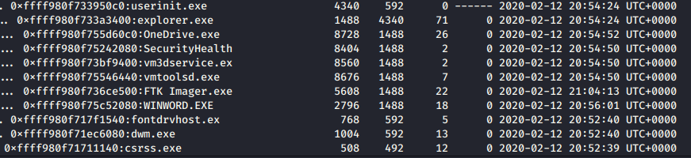

FTK Imager.exe is the correct answer here. 

### Memory forensics 4

S-1-5-21-2034586335-2782532192-897599191-1001

This was correct. I used Volatility to output all ssids into file and searched for Rodrigo Gonzales, as he was the fictitious protagonist in all of the challenges. Poor Rodrigo. 

## OSINT

Perhaps my favorite part of the CTF was the OSINT-section. 

### OSINT 1

"Investigate foo.bar@(redacted)"

First I went to https://osintframework.com and opened the tree for email address. I tried pretty much everything there was, even the services where you had to register to find info about an email address you were searching for. I tried Google dorking. I tried with services like That's them, Pipl, I tried theHarvester, VerifyEmail, tried emailing the actual email address. I tried Pastebin. I tried to find the email on different social media platforms. All to no avail.

It was later revealed that a glitch in the Matrix had deleted a “dumped” password for the account from Pastebin thus rendering the challenge unsolveable.

I learned a lot of cool new tools so this was not a fail in my eyes!

### OSINT 2

"Can you find anything special from foobar.(redacted) ?"

I once again used https://osintframework.com/ and went to dnsdumpster.com, input foobar.(redacted) and received the text: c29tZXRoaW5nc3BlY2lhbC5oZWxzZWMuZmkK and recognised it as Base64 encoded text. It Base64 decoded to somethingspecial.(redacted) on https://www.base64decode.org

Checked the new address somethingspecial.(redacted)
Received c3ludHtHVVJFUl9WRl9OWUpOTEZfRkJaUkdVVkFUX1ZBX1FBRn0K
Base64 -> synt{GURER_VF_NYJNLF_FBZRGUVAT_VA_QAF} -> this was not Base64, I wonder what it is: https://tech.pookey.co.uk/non-wp/encoder-decoder.php helped me with this

I tried different decoders and eventually decoded from ROT13 to the actual flag

message:
synt{GURER_VF_NYJNLF_FBZRGUVAT_VA_QAF}

result:
flag{THERE_IS_ALWAYS_SOMETHING_IN_DNS}

### OSINT 3

"Rodrigo Gonzales is slipping from OPSEC on their recent beer related social media post."

Google is an extremely powerful tool in OSINT. I knew what I was looking for: person name, beer-related and social media. So I entered “Rodrigo Gonzales beer” and looked through the results. Sure enough, I found a Twitter account with a picture stating: “All beer is good! But free beer is better!” Under the picture was a yellow Post-It note with a Base64 encoded text that translated to the flag:
flag {0PS3C}
